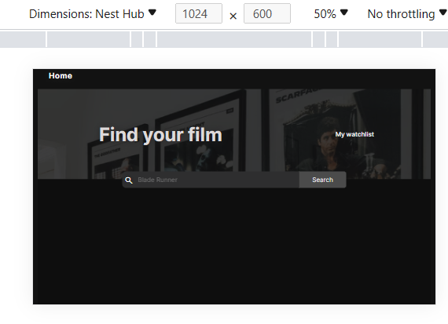

# Coulture

An incredible project which I created out of my desire to make clients want 
to come back for more. This project was inspired by my dream for easiness of
having a rich screensaver/wallpaper which a user can change at anytime
depending on his multiple preference via refreshing the site at ease 
which most sites don't have.

It also has a movielist link to allow clients have enrich access to multiple
of movies to watch in the future. The user can search the movie via our 
search button, select and add the movie to their watchlists which will
 be saved to their devices and they can equally delete the movies whenever
they want on [watchlist url](./md-images/devices/navigation-1.png).


__Other Features__:
- View bitcoin market value in real time when coulture homepage is on display. 
- Change the color theme of bitcoin market capitalization when the user 
    hovers on it. Thus optimizing the visual effect of the user.
- Have an access to `time diplay` no matter the user location in the world,
 thus displaying each user timezone in real-time. This is made possible because
  I used `toLocaleTimeString` method during the course of Coulture development.
- View motivational quotes at each time when the user is on the homepage which 
gets updated every 12 hours by itself, thanks to Javascript ` setInterval` method.
- The user owns the site via having full control where saved  watchlist movies
 are stored and when to delete them. This is made possible because I used 
 `Windows localstorage functionalities` which in turn could be of help as a 
 developer not to have worries which database to use or not. Local storage was
  really used because the data retrieved from OMDAPI is entirely insensitive data. 
So in my opinion, it is a win-win situation between myself and the user.
- Anytime the user want to add or delete a movie, add or delete icons will 
automatically appear which fades away in 1900 milliseconds, this functionality 
will increase user experience when performing the said tasks in our website.
Thus, making the user have that assured feeling that yes my movie was
 added/saved successfully.
- Navigation to different `URLs` is done at ease by the user back and
 forth with enrich theme color for UI/UX by the user.
- [Search functionality](./md-images/customized-search-icon.png) is heavily 
improved with a search icon, and search button to increase the user 
experience based on the user keystroke on the search-bar for the movie the user 
wants which displays all the available movies with that keystroke input by the
 user,and if the movie is not available, ofcourse the `catch block` error 
 method will display the error message of unavailability of the movie.

### __Responsive Web Design Implementations:__
 As a fullstack developer, I am aware that working on this side project, 
 Coulture, I don't have a UX/UI designer which are heavily available in many 
 companies during project development. My work as a software 
 Engineer is to give live to the mock up design made available by UX/UI designer.
  Since I don't have that personnel at my disposal,
I have to hone the task by myself via following
 design fundamental rules throughout the developmental process of this project. Thanks
 to my sound knowledge too on UI/UX design as a certified proffesional 
 in that angle. 
 Thus, I implemented semantic html markup and the 7 fundamental User Interface
 designs which are *Alignment, Typography, Whitespace, Contrast, Scale, Color
 and Visual Hierrachy* 
in my project to make it looks great on both large, medium and small devices of
the user.

 Following the semantic html markup to meet up with computer and human readability,
 I tried to markup my entire html and javascript in that approach so that even 
 assistive technologies, search engines and web browsers can easily grap my markups 
 very easily. Some semantic html used are main, section, alt, title, header, nav etc.

__Eg of code snippet utilizing semantic html market is below__:
```html
<section class="container">
            <div class="main-content">
                <div class="searchbar">
                    <span class="material-icons">search</span>
                    <input type="search" placeholder="Blade Runner"
                    name="search" class="search-input"
                    >
                    <button class="search-btn">Search</button>
                </div>
            </div>
            <div class="image-content">
                
                <p>Start exploring</p>
            </div>
            <div class="movie-dashboard"></div>

        </section>
```

#### On Large Devices: eg Laptops, Desktop
On Large devices, I made sure I aggresively followed the 7 UI fundamentals to get the job done during my CSS workthrough and designs, and run routine check in all of them using my Edge and Chrome  Explorer at all time to view my CSS rulesets and see their behaviors where I want them to be applied. 
Using [Web Content Accessibility Guidelines (WCAG)](./md-images/devices/WCAG.png) tool which to me is a great extension I love using to meet up the standard needed in content accessibility for web deelopment, I was able to detect and work on [several errors](./md-images/added-aria-label-issue-movielist-page3.png) which I saw, and work my way towards improving most of them since I care so much on design pattern and aesthetic beauty of my website. It was indeed a huge asset especially in color contrast ratio, Typography and alignments. For example, on [Coulture home page](./md-images/devices/page-1.png) it's WCAG is 100%, same with [Watchlist page](./md-images/automated-scan-of-movielist.png) while movielist page gave us 98% which to me is a great work done on accessibility/ UI design part.

Worth noting that during the design stage, I worked my way through from large devices and narrow it down to small devices, thanks to CSS `flexbox layout, other box-models like padding, margin, float etc` which where extensively utilized throughout the coulture project.

*Visual Representation of Couture project on large screen:* <br>
1. Home page <br>
 

2. Movie List Page <br> <br>
    

3. Watchlist Page URL <br> <br>


#### On Medium Devices eg Tablet: 
Similar UI development design used on large scale devices where also applied here. And everything worked perfectly as I expected them to be.

*Pictorial Representation are hereof for your perusal*:
1. Home page <br>
 

2. Movie List Page <br> <br>
    

#### On Small Devices: Mobile Phones
On small devices which appears to be heavily dominant in the market now based on users. I so much prioritized on it's unique design using the core 7 UI fundamentals to capture all the small devices out there via using my edge developers tool to get the work done and equally testing them live with my friends Phones of all sizes too. I used media query of 300px to 600px to achieve that in a unique fashion.

_Example of some of it's code snippet for your perusal (grapped from movielist.css):_

~~~CSS


@media (min-width: 300px) and (max-width:670px) {
    .navbar {
        display: flex;
        flex-direction: column;
    }
    .movie-container {
        display: flex;
        flex-direction: column;
        width: 400px;
        height: 100%;
        justify-content: center;
        align-items: center;

    }

    .header-container {
        display: flex;
        width: 400px;
        font-size: .75em;
    }

    .added-text,
    .removed-text{
        font-size: 0.625em;
    }
~~~

*Visual Representation of Couture project on small screen devices:* <br>
1. Home page <br>
 

2. Movie List Page <br> <br>
    

3. Watchlist Page URL <br> <br>


### Unittesting: using Jasmine Framework:


Tech Stacks used:
1. Javascript
2. JSON
3. HTML
4. CSS
5. Jasmine Unittest Framework

__Project Acknowledgment__:
1. Influenced by [scrimba](scrimba.com) platform, thanks to their incredible tutors especially Bob Ziroll who gave us the platform to grow our learning in Software development
2. API data via JSON were fetched from these resources:
    - Unsplash 
    -  OMDAPI
    -  Coingecko
    - Fit
3. Sponsored by Pharm Umeh Vivian
4. Throughout the course of the [Coulture](https://splendid-cactus-b50379.netlify.app/movielist.html) project development, if I have any questions or stuck somewhere, I don't hesistate to ask questions on these wonderful channels:
    - [MDN wesbite](https://developer.mozilla.org/ 'mozilla')
    - [Stackoverflow](https://stackoverflow.com 'stackoverflow website')
    - [scrimba discord channel](https://discord.com/channels/684009642984341525/919150760204329020)
    - [Jasmine](https://jasmine.github.io/tutorials/your_first_suite 'Jasmine tutorial site') where I had my deep dive into unittesting and importance of BDD months ago prior to this project.
5. ### Contributors:
    Shout out to my senior software engineers, great friends and family for their mentorship, support and code review. Thanks to them: <br>
     - [Engr Eric Okemmadu](https://www.linkedin.com/in/engreric000 'Founder at Mentortribes, CTO at Vitas Inc')
     - [Engr Igboke Augustine](https://www.linkedin.com/in/augustine-igboke 'Software Engineer   @ Flutterwave')
     - [Engr Enyelu Ebuka](https://www.linkedin.com/in/chukwuebuka-enyelu-948a31b9 'software Engineer @ Axxess')
     - [Pharm Ejike Pascal](https://www.linkedin.com/in/pascal-ejike-090885200) 
     - [Ejikeme Kester](https://twitter.com/Kester89Autos?t=gaAFAMzIcwBR5B2A5ToCUQ&s=35")
     - [Dr Uche Ejezube](https://www.facebook.com/profile.php?id=100008718735954&mibextid=2JQ9oc)
